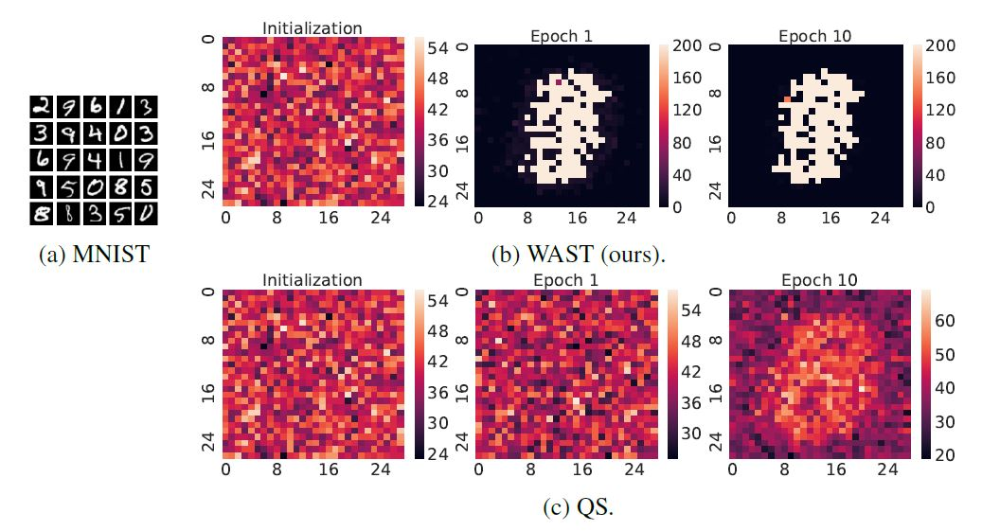

# Supervised Feature Selection using Truly Sparse Methods

This repository outlines the code of my Master Thesis, concerning supervised feature selection using truly sparse methods. 
### Please note that this readme is a work in progress and none of the information in it is neither final nor likely correct
Code repository belonging to Master Thesis at Technical University of Eindhoven, under supervision by Decebal Mocanu. Based on code by Sokar, Atashgahi, Mocanu (TBD)

# Abstract

TBD

# Usage

TBD 

# Results
 
To be changed
