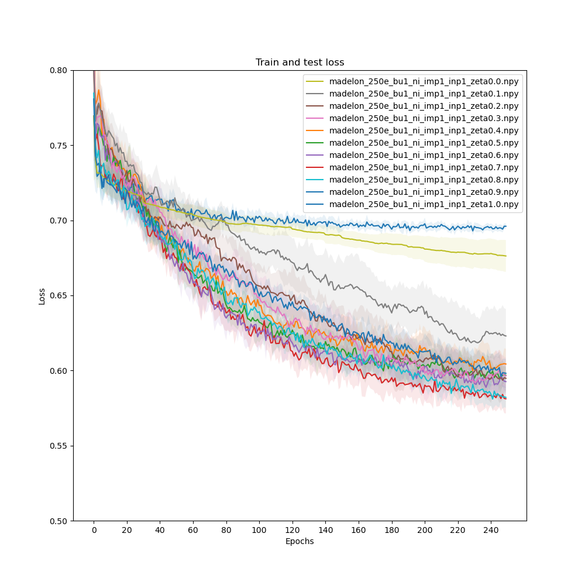

# Supervised Feature Selection using Truly Sparse Methods


This repository outlines the code of my Master Thesis, concerning supervised feature selection using truly sparse methods. 
### Please note that this readme is a work in progress and none of the information in it is neither final nor likely correct
Code repository belonging to Master Thesis at Technical University of Eindhoven, under supervision by Decebal Mocanu. Based on code by Sokar, Atashgahi, Mocanu (TBD)

# Abstract

TBD

# Usage

The code can be run using the following command in the terminal

```shell
python set_mlp_sequential.py   
```

Please refer to the argparser for possible arguments. The following arguments are used in the final paper: 

<details><summary>Chosen arguments</summary>

```shell
python set_mlp_sequential.py epochs=250, runs=10, batch_size=128, lr=0.001, momentum=0.9, epsilon=20, nhidden=200, K=20, lamda=0.9, zeta=0.3, dropout_rate=0.3, weight_decay=0.0002, allrelu_slope=0.6, eval_epoch=5, data='madelon', update_batch=True, input_pruning=True, importance_pruning=True, plotting=False)
```

</details>


# Results
##  Loss plots for different methods
### Madelon dataset
#### Comparing different values of ```zeta```



