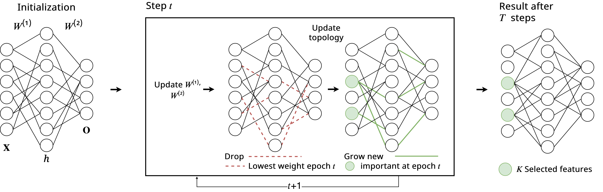

[](https://github.com/psf/black)
# Supervised Feature Selection using Truly Sparse Methods



This repository outlines the code of my Master Thesis, concerning supervised feature selection using truly sparse methods.
### Please note that this readme is a work in progress and none of the information in it is neither final nor likely correct
Code repository belonging to Master Thesis at Technical University of Eindhoven, under supervision by Decebal Mocanu. Based on code by Sokar, Atashgahi, Mocanu (TBD)

# Abstract

This paper offers an in-depth evaluation of the newly introduced Feature Selection using A Sparse Training Regime (FASTR) method, benchmarking it against other established methods on synthetic and real-world data. The research questions at the heart of this study focus on FASTR's performance in a supervised environment, its advancements over the binary masking implementation, and the factors that influence the feature selection performance of a sparse Multilayer Perceptron (MLP). Through a series of rigorous experiments, FASTR demonstrated consistent performance across multiple synthetic datasets, suggesting its potential as a reliable feature selection method. This robustness was further substantiated in a second experiment, where FASTR showed strong performance across various real-world datasets. Subsequent experiments delved deeper into the factors influencing the feature selection performance of a sparse MLP. The results indicated that initializing weights close to zero was most effective, while the impact of pruning on the hidden layer remained inconclusive. Not having input pruning showed a slight advantage, and using the neuron importance metric showed a slight but non-significant advantage. In conclusion, this study provides valuable insights into the feature selection performance of sparse MLPs, demonstrating the potential of FASTR as a robust and reliable feature selection method. The findings also shed light on the factors influencing the performance of a sparse MLP, contributing to the broader understanding of feature selection using truly sparse neural networks.

# Usage
TBD

# Results
##  Loss plots for different methods
### Madelon dataset
#### Comparing different values of ```zeta```

